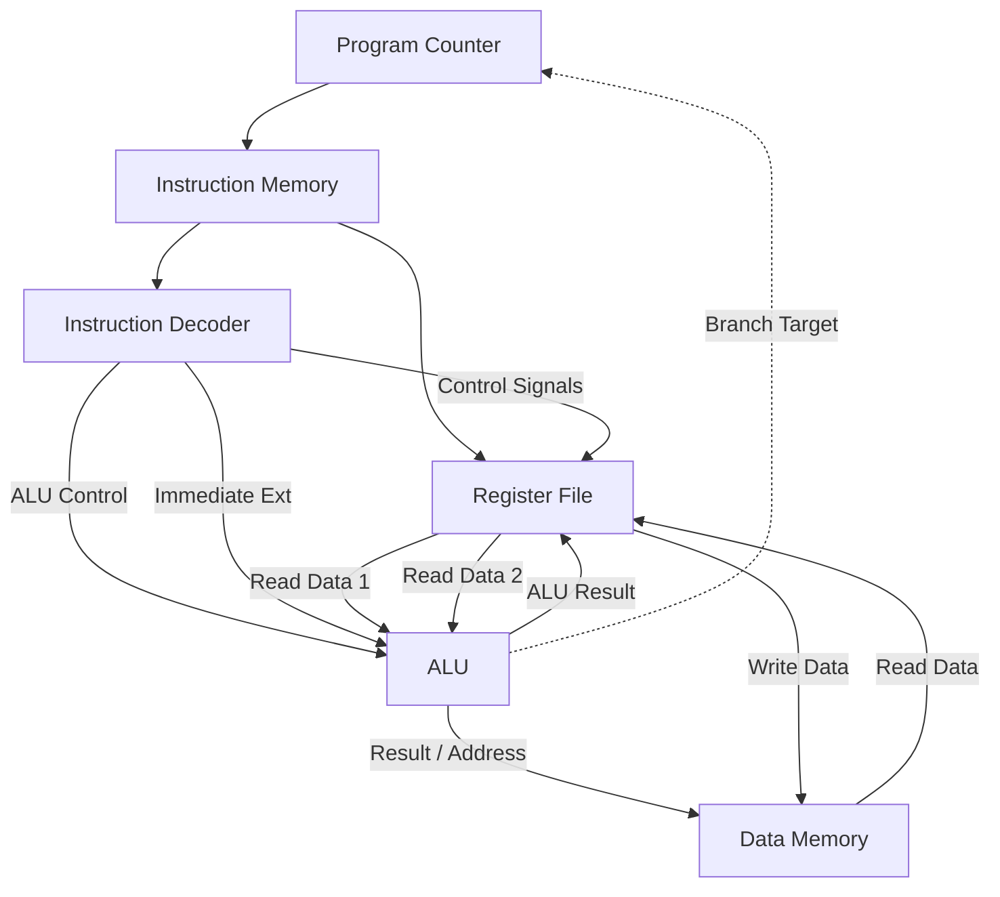

#  RV32I Single-Cycle RISC-V Processor

An entirely from-scratch, 32-bit single-cycle RISC-V processor core written in Verilog. This project implements a subset of the standard RV32I base integer instruction set and is constrained for physical implementation on the **Digilent Nexys A7-100T FPGA**.

I built this project to deepen my understanding of computer architecture, datapath routing, and RTL design for synthesis. 

## Features
* **Architecture:** 32-bit Single-Cycle Datapath.
* **Instruction Set:** Supports core RV32I instructions (R-type, I-type, Loads, Stores, and Branches).
* **Target Hardware:** Xilinx/Digilent Nexys A7-100T (Artix-7 FPGA).
* **Design Language:** Verilog-2001 (Clean, modular, and synthesis-ready).
* **Verification:** Includes a self-contained testbench executing live machine code.

## Architecture Block Diagram

## Getting Started (Simulation)
You can simulate this core using Xilinx Vivado, ModelSim, or open-source tools like Icarus Verilog.

1. Create a new RTL project in your simulator.
2. 
3. Add all `.v` files from the `src/` directory as design sources.
4. Add `tb_simple.v` as your simulation source.
5. Run the simulation for **100ns**. 
6. **Verification:** Look at the waveform for `dmem[0]` at **55ns**. You will see the processor successfully calculate `5 + 10` and store the result (`15` or `0x0F`) into memory!

## What I Learned
Building this wasn't just an exercise in writing Verilog; it taught me how to debug hardware at the waveform level. I learned how to track signals propagating through combinational logic, how to prevent unwanted latches during synthesis, and how to manage standard FPGA constraints (like active-low resets and 100MHz clock timing). 

---
*Designed by [Sparsh Kumar] *
